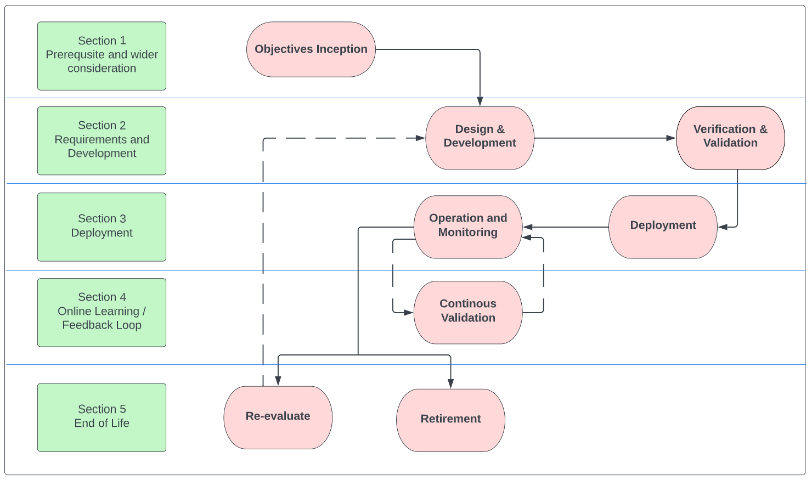

+++
title = "Inferno"
sort_by = "weight"
+++

## Key Hypothesis

Insights generated by Machine Learning products need protection against adversaries, which help establish end-user trust.
This project establishes a risk-assessment matrix based on the complexity and severity of attack vectors and potential mitigation steps for use by data scientists.

Project Inferno aims to provide guidance on securing Machine Learning pipelines against possible attack vectors, and monitor security of the Machine Learning environments.

## Example Workflow

After the decision to develop a Machine Learning system, there are security questions for consideration.
Many decisions at this stage are driven by scope: is the intent for the model to be operational, or
research purposes only? An example workflow diagram is intended to help assess:

## Secure Principles for MLOps

- Enable your developers: Are your data scientists and developers aware of ML security threats and model failure modes
- Design for security: What does your system look like if the ML component fails?
- Minimize an adversary's knowledge: Understand that attackers can gather information to strengthen attacks.
- Secure your supply chain: Obtain your data and models from a trusted source.
- Track your assets: Operation and lifecycle management of models and datasets.
